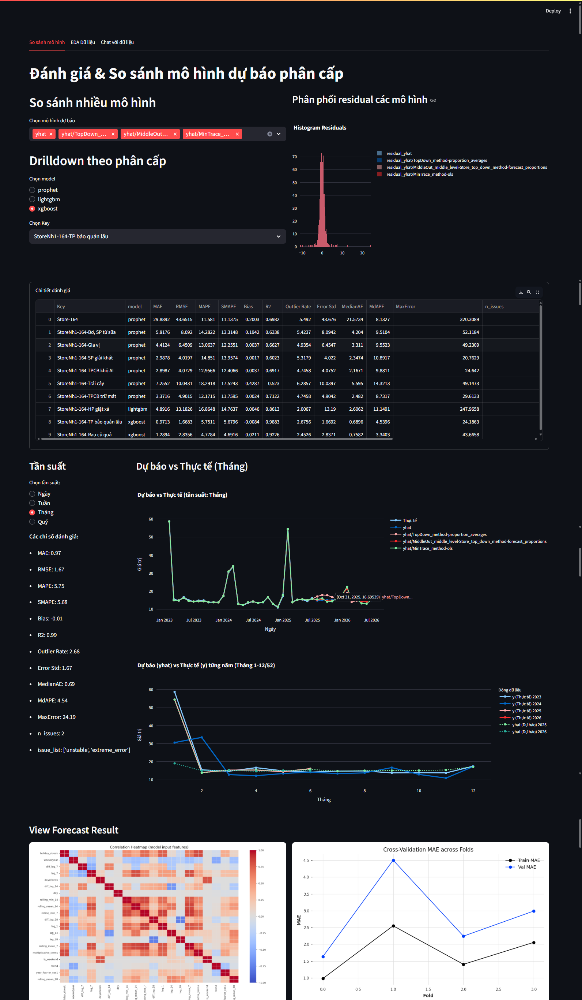
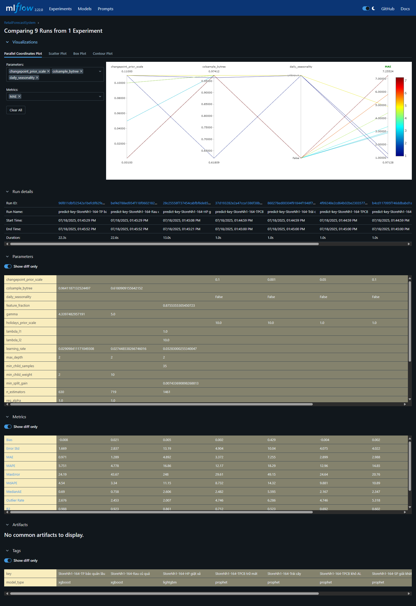

# 🛒 Retail Sales Forecasting System

A production-grade, modular, and scalable platform for **sales forecasting across multiple stores and product groups**, built for large retailers.
Combines state-of-the-art ML (XGBoost, LightGBM), statistical models (Prophet), clustering, and GenAI (LLM RAG), fully automated with MLOps best practices (DVC, MLflow, Airflow, Dagster, FastAPI, Streamlit)

---

## 📖 Table of Contents

- [🛒 Retail Sales Forecasting System](#-retail-sales-forecasting-system)
  - [📖 Table of Contents](#-table-of-contents)
  - [📝 Project Overview](#-project-overview)
  - [🚀 Features](#-features)
  - [📁 Project Structure](#-project-structure)
  - [⚙️ Installation](#️-installation)
  - [🛠 Usage](#-usage)
    - [1️⃣ **DVC Pipeline**](#1️⃣-dvc-pipeline)
    - [2️⃣ **Dagster Pipeline**](#2️⃣-dagster-pipeline)
    - [3️⃣ **Python CLI / Typer**](#3️⃣-python-cli--typer)
    - [4️⃣ **Serving and Visualization**](#4️⃣-serving-and-visualization)
    - [5️⃣ Documentation Site](#5️⃣-documentation-site)
      - [**View docs:**](#view-docs)
  - [📊 Outputs](#-outputs)
  - [📈 Evaluation Metrics](#-evaluation-metrics)
  - [🏗️ Architecture \& Workflow](#️-architecture--workflow)
  - [🚦 Future Roadmap](#-future-roadmap)
  - [👤 Author](#-author)
  - [📜 License](#-license)

---

## 📝 Project Overview

This system is designed for **sales forecasting at scale** (multiple stores, many products, multi-region).
The pipeline is fully automated and modular, supporting:

- **Data ingestion** (from multiple sources)
- **Preprocessing & feature engineering** (statistical, business, auto features, LLM-RAG)
- **Clustering & specialization** (tailored models per group)
- **Hybrid modeling** (XGBoost, LightGBM, Prophet, LLM)
- **Multi-step, multi-level forecasting** (recursive, direct, hybrid, hierarchical reconciliation)
- **Monitoring, explainability, and reporting** (Streamlit, SHAP, LLM reports)
- **MLOps** (DVC, MLflow, Airflow, Dagster, FastAPI deployment)

The platform supports **batch and real-time prediction**, is extensible, and ready for both research and production.

---

## 🚀 Features

- **Automated, reproducible ML pipeline** (data to deployment)
- **Advanced feature engineering** (time, lag, statistics, business, TSFresh, LLM-augmented)
- **AutoML and hyperparameter tuning** (Optuna/GridSearch)
- **Clustering for model specialization** (KMeans, GMM)
- **Flexible model selection:** Prophet, XGBoost, LightGBM, LLM-RAG
- **Multi-step and hierarchical forecasting:** recursive, direct, hybrid, reconciliation (Bottom-up, Top-down, Middle-out, OLS, MinTrace)
- **Explainability:** SHAP, LLM auto-diagnosis, reporting
- **MLOps:** MLflow (metrics, models), DVC (data versioning), Airflow/Dagster (orchestration), FastAPI (serving), Streamlit (visualization)
- **Batch & real-time forecasting**
- **Designed for extensibility:** easily add new models, features, or data sources

---

## 📁 Project Structure

```text
retail-forecast-system/
│
├── airflow/                  # Airflow DAGs for orchestrating data pipelines and batch workflows
│   └── dags/
│       └── system_retail_pipeline.py   # Main Airflow DAG for retail system pipeline automation
│
├── api/                      # FastAPI app – RESTful API endpoints for inference, health check, etc.
│   ├── endpoints.py          # API route handlers
│   ├── main.py               # API app entrypoint
│   ├── schema.py             # Pydantic schemas for request/response validation
│   └── utils.py              # API-specific utilities
│
├── app/                      # Lightweight app front-end or dashboard (e.g. Streamlit, Gradio, etc.)
│   ├── pages/                # Individual app pages (e.g., EDA, visualization)
│   │   └── EDA.PY            # Exploratory Data Analysis dashboard page
│   ├── vectordb/             # Vector DB index files (for embedding, semantic search, etc.)
│   │   └── faiss.index       # FAISS index for fast vector search
│   ├── README.md             # App-specific README/instructions
│   └── app.py                # Main app entrypoint
│
├── config/                   # YAML configuration files for parameters, models, paths
│   ├── config.yaml           # Global project config (paths, globals)
│   └── models.yaml           # Model-specific hyperparameter config
│
├── dagster_pipeline/         # Dagster pipeline definitions (alternative or complement to Airflow)
│   ├── assets.py             # Dagster asset definitions
│   ├── dagster.yaml          # Dagster config
│   ├── jobs.py               # Job orchestration (Dagster)
│   └── schedules.py          # Scheduled jobs (Dagster)
│
├── data/                     # Data storage (DO NOT track raw here if using DVC!)
│   ├── feature-store/        # Feature store for ML training/inference
│   ├── interim/              # Intermediate, cleaned, or transformed data for experiments
│   ├── output/               # Output from batch predictions, evaluations, etc.
│   ├── processed/            # Final/production-ready datasets
│   ├── raw/                  # Immutable raw source data (never edit manually)
│   └── sql/                  # SQL scripts for ETL or data exploration
│
├── docs/                     # Project documentation (Markdown + site output for mkdocs)
│   ├── docs/                 # Main docs in Markdown, organized by topic
│   ├── .gitkeep              # Ensures folder in git if empty
│   ├── README.md             # Documentation for documentation! (Contributing, etc.)
│   └── mkdocs.yml            # mkdocs configuration for static site generator
│
├── mlruns/                   # MLflow experiment tracking (auto-created, ignore unless using MLflow)
│
├── models/                   # Serialized trained models, artifacts, and checkpoints
│   └── .gitkeep              # Keep empty directory tracked by git
│
├── notebooks/                # Jupyter/Colab notebooks (experimentation, prototyping, reports)
│   ├── .gitkeep              # Empty dir marker
│   ├── [1]_EDA.ipynb         # Exploratory Data Analysis notebook
│   ├── [2]_Report.ipynb      # Project summary report notebook
│   └── [3]_Pipeline-model.ipynb  # Modeling/ML pipeline notebook
│
├── rag/                      # Retrieval-Augmented Generation (RAG) code and configs
│   ├── prompts/              # Prompt templates for LLM-driven RAG workflows
│   │   └── file_analysis.yaml# RAG prompt for file analysis
│   ├── chunking.py           # Text chunking utilities for RAG
│   ├── data_loader.py        # Data loading utilities for RAG
│   ├── embedding.py          # Embedding functions/classes
│   ├── llm.py                # LLM interface
│   ├── pipeline.py           # End-to-end RAG pipeline definition
│   ├── prompt_engine.py      # Prompt engineering logic
│   ├── reranker.py           # Result reranking logic
│   ├── retriever.py          # Retrieval utilities
│   └── vectordb.py           # Vector database wrapper
│
├── reports/                  # Generated reports, figures, and output for business/tech
│   ├── figures/              # Visual assets, plots, images for reporting
│   └── .gitkeep              # Keep empty directory in git
│
├── src/                      # Core source code: ETL, ML, feature engineering, modeling, etc.
│   ├── db/                   # Database connection and pipeline modules
│   ├── features/             # Automated/manual feature engineering scripts
│   ├── modeling/             # ML/DL model classes and logic (XGBoost, LSTM, Prophet, etc.)
│   ├── strategies/           # Forecasting strategies: benchmark, multi-step, etc.
│   ├── utils/                # General-purpose utility functions
│   ├── config.py             # Centralized configuration loader/manager
│   ├── cross_validator.py    # Custom cross-validation logic for time series
│   ├── feature.py            # Feature store logic/integration
│   ├── forecast_pipeline.py  # End-to-end forecast pipeline logic
│   ├── load_data.py          # Data loading and parsing logic
│   ├── plots.py              # Visualization utilities for model results
│   ├── predict.py            # Inference logic for predictions
│   ├── preprocess.py         # Data preprocessing/cleaning logic
│   ├── reconcile.py          # Hierarchical reconciliation logic
│   └── train.py              # Training orchestration/entrypoint
│
├── .dvcignore                # DVC ignore patterns for data version control
├── .env                      # Environment variables (never commit secrets!)
├── Dockerfile                # Docker image definition for reproducible builds/deployment
├── Makefile                  # Automate project workflows (train, test, build, lint, etc.)
├── README.md                 # Project overview, usage, and instructions (first file people read)
├── docker-compose.yaml       # Multi-container Docker orchestration (dev/test/prod)
├── dvc.lock                  # DVC pipeline lock file (auto-generated)
├── dvc.yaml                  # DVC pipeline config for data versioning
├── install_ray.bat           # Script to install Ray for distributed processing
├── main.py                   # Project CLI/main entrypoint (run pipelines, apps, etc.)
├── pyproject.toml            # Python project metadata/build config (PEP 518+)
└── requirements.txt          # Python package dependencies (always pin versions for reproducibility)

```

---

## ⚙️ Installation

**1. Prerequisites:**

- Python ≥ 3.9
- pip, git
- (Optional): DVC, MLflow, Streamlit, Airflow/Dagster, Docker

**2. Clone the repository:**

```bash
git clone https://github.com/your-org/retail-forecast-system.git
cd retail-forecast-system
```

**3. Create and activate virtual environment:**

```bash
python -m venv .venv
source .venv/bin/activate
```

On Windows:

```bash
.venv\Scripts\activate
```

**4. Install dependencies:**

```bash
pip install --upgrade pip
pip install -r requirements.txt
```

**5. (Optional) Install extra tools:**

```bash
pip install dvc mlflow streamlit
```

**6. Set up `.env` file for credentials, DB, API keys**

```bash
cp .env-example .env
```

---

## 🛠 Usage

### 1️⃣ **DVC Pipeline**

Run the **full pipeline** (from raw data to output, all stages auto-tracked):

```bash
dvc repro
```

- Runs every stage in `dvc.yaml` .
- Outputs, models, metrics, and plots are versioned and reproducible.

**Run a specific stage:**

```bash
dvc repro feature-engineering
dvc repro train-xgboost
```

**Visualize pipeline DAG:**

```bash
dvc dag
```

---

### 2️⃣ **Dagster Pipeline**

**Run with Dagster (for orchestration, monitoring, and visualization):**

```bash
dagster dev
```

- Access Dagster UI at [http://localhost:3000](http://localhost:3000)
- Trigger jobs/assets , monitor status, debug runs.

**Example CLI:**

```bash
dagster job execute --job-name train_xgboost
dagster asset materialize --select feature_engineering
```

_Requires code mapping between pipeline stages and Dagster assets/jobs._

---

### 3️⃣ **Python CLI / Typer**

**Manually run each stage** (for debugging, dev, or running small parts):

```bash
# Load data
python main.py load-data load-data --end-date 250630

# Preprocess: transform, cluster, filter
python main.py preprocess transform --input-file sales.csv --holiday-file holidays.csv --output-file transformed.csv
python main.py preprocess cluster-model --input-file transformed.csv --output-file data_clustered.csv --visualize
python main.py preprocess filter-data --input-file data_clustered.csv --output-file filtered.csv

# Feature engineering
python main.py feature-engineering feature-engineering --input-file filtered.csv --holiday-file holidays.csv --max-workers 8

# Train models (XGBoost/LightGBM/Prophet)
python main.py train batch-train --input-file train.csv --holiday-file holidays.csv --model-type xgboost --max-workers 8
python main.py train batch-train --input-file train.csv --holiday-file holidays.csv --model-type lightgbm --max-workers 8
python main.py train batch-train --input-file train.csv --model-type prophet --max-workers 8

# Predict
python main.py predict batch-predict --file-train train.csv --max-workers 8

# Reconcile (hierarchical forecast)
python main.py reconcile reconcile --input-file batch_forecast_results.csv --output-file reconciled_forecast_hierarchical.csv
```

---

### 4️⃣ **Serving and Visualization**

- **API serving:**

  ```bash
  uvicorn api.main:app --reload
  ```

  Access Swagger UI at [http://localhost:8000/docs](http://localhost:8000/docs)

- **Dashboard (Streamlit):**

```bash
streamlit run app/app.py
```



- **Experiment tracking (MLflow):**

  ```bash
  mlflow ui
  ```

  Open [http://localhost:5000](http://localhost:5000) for experiment history
  
  

- **Notebook EDA/prototyping:**

  ```bash
  jupyter notebook
  ```

---

### 5️⃣ Documentation Site

#### **View docs:**

```bash
pip install mkdocs
mkdocs serve
```

- Open [http://localhost:8000](http://localhost:8000)

<details>
  <summary>All documentation lives in docs folder</summary>

1. [Getting Started](docs/docs/getting-started.md)
2. [Installation Guide](docs/docs/install.md)
3. [Project Structure](docs/docs/structure.md)
4. [Pipeline Architecture](docs/docs/architecture.md)
5. [Feature Engineering](docs/docs/feature_engineering.md)
6. [Model Overview](docs/docs/models.md)
7. [Forecasting Strategies](docs/docs/strategies.md)
8. [Tooling & MLOps](docs/docs/tools.md)
9. [Docs Site](http://localhost:8000)

</details>

---

## 📊 Outputs

- `batch_forecast_evaluation.csv`
- `batch_forecast_results.csv`
- `forecast_evaluation_summary.csv`
- `reconcile_evaluation.csv`
- `reconciled_forecast_hierarchical.csv`

> 📖 See [docs/structure.md](docs/docs/structure.md) for full details

---

## 📈 Evaluation Metrics

- **MAE**: Mean Absolute Error
- **RMSE**: Root Mean Squared Error
- **MAPE**: Mean Absolute Percentage Error
- **SMAPE**: Symmetric MAPE

---

## 🏗️ Architecture & Workflow


The pipeline automates the full ML lifecycle:

1. **Data Ingestion:** Aggregate data from multiple sources, standardize format (`ds`, `y`, regressors).
2. **Preprocessing:** Clean missing values, handle outliers, aggregate/disaggregate as needed.
3. **Feature Engineering:**

   - **Automated:** TSFresh auto extraction (Fourier, energy, stats, autocorr).
   - **Manual:** Business features (e.g. wholesale, visits).
   - **Hybrid:** Prophet decomposition as features.
   - **LLM-RAG:** GenAI suggests, filters, and summarizes features.

4. **Feature Selection:** AutoML (Darts), SHAP, LLM-RAG, and stats select best feature set.
5. **Clustering:** KMeans/GMM to group time series, adapt model per group.
6. **Model Training:** Train XGBoost, LightGBM, Prophet based on cluster/hierarchy; normalize features.
7. **Hyperparameter Tuning:** Optuna/Grid Search per cluster/model.
8. **Cross-Validation:** Time series cross-validation to estimate out-of-sample accuracy, select best models.
9. **Model Evaluation:** MAE, MAPE, RMSE, SMAPE. All logged in MLflow.
10. **Forecast Reconciliation:** HierarchicalForecast (Bottom-up, Top-down, Middle-out, OLS, MinTrace).
11. **Deployment:** Latest model served via FastAPI for batch/real-time inference.
12. **Visualization:** Streamlit dashboard, forecast vs. actual, error analysis, LLM-generated insight.

**Multi-step and Hierarchical Forecasting:**
Supports recursive, direct, and hybrid multi-step strategies. Hierarchical reconciliation guarantees coherence across levels (system, area, store, product, SKU).

---

## 🚦 Future Roadmap

- [ ] Expand LLM-based business scenario generation and automated reporting
- [ ] Real-time retraining triggers (Airflow)

---

## 👤 Author

- **Nguyễn Thanh Vinh**
- Email: [vinhnguyenad22@gmail.com](mailto:vinhnguyenad22@gmail.com)
- GitHub: [https://github.com/vinhnguyen-22](https://github.com/vinhnguyen-22)

---

## 📜 License

MIT License. See `LICENSE` for details.

---

**_This system combines the flexibility of Python, the power of modern ML, and the best MLOps practices for robust, scalable, and explainable retail forecasting. For extension, troubleshooting, or custom deployment, see docs/ or contact the author._**
