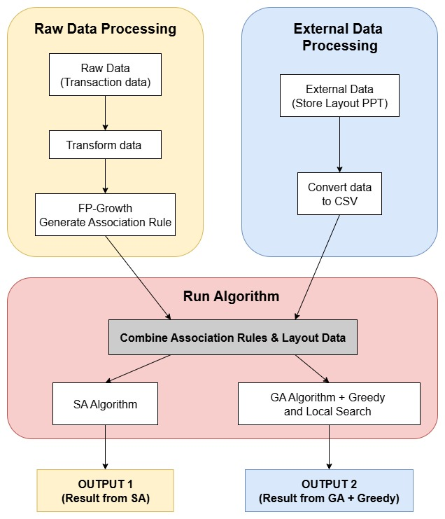

# 4. Workflow

  <strong style="color: #7B4DB3; font-size: 24px;">OPTIMIZATION LAYOUT WORKFLOW</strong>

 

The workflow consists of the following stages:
## 1. Input Acquisition

### 1.1 Raw Data

Collect customer transaction records from the database, including fields such as BillId, CustomerId, Date, StoreId, Sku, Quantity, Sales, Cost, etc. This provides a complete view of each shopping basket, enabling customer purchasing behavior analysis.

### 1.2 External Data

Obtain store layout files in PowerPoint format, containing shapes that outline product group areas. Each shape corresponds to a product category and is used to capture spatial attributes such as location, width, and height.

## 2. Data Processing

### 2.1 Transaction Data Transformation

- Aggregate SKUs into higher-level product groups (e.g., Level-2 categories such as Fresh Milk, Confectionery) to reduce dimensionality.

- Remove invalid or low-value transactions.

- Calculate sales and other relevant metrics for each product group per transaction.

### 2.2 Store Layout Conversion

- Parse the PowerPoint layout file to extract product group information.

- Convert spatial attributes (coordinates, dimensions) into a structured CSV format for algorithmic processing.

## 3. Pattern Mining — FP-Growth

Apply the FP-Growth algorithm to the transformed transaction dataset to discover frequent itemsets, representing product group combinations with strong co-occurrence patterns in customer purchases.

## 4. Optimization Algorithms

Combine the outputs from both transaction analysis and store layout conversion as input to two independent optimization methods:

- Simulated Annealing (SA)

- Genetic Algorithm (GA) with Greedy and Local Search

Each method generates alternative store layout configurations aimed at improving sales and operational efficiency.

## 5. Output Evaluation

Compare the resulting layouts from both optimization methods to determine the most effective configuration for boosting revenue, improving customer shopping flow, and enhancing store performance.