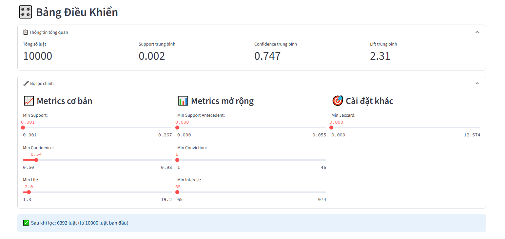
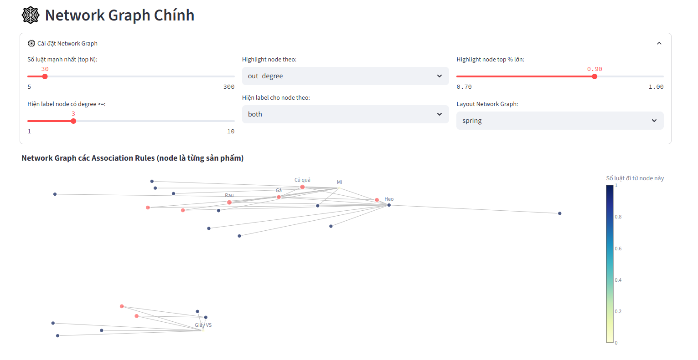
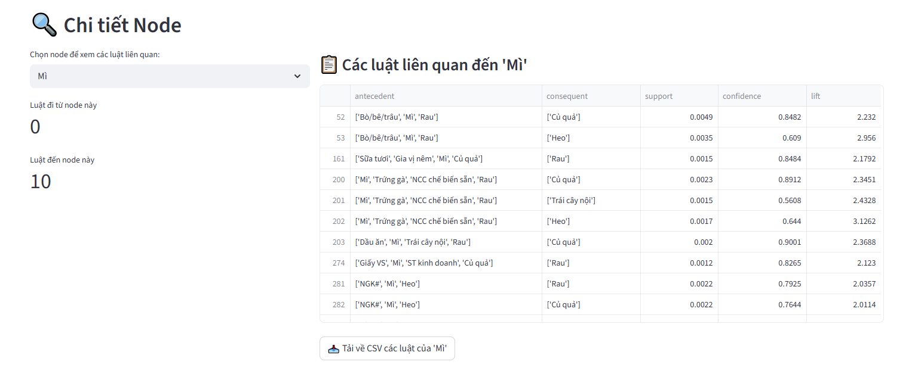
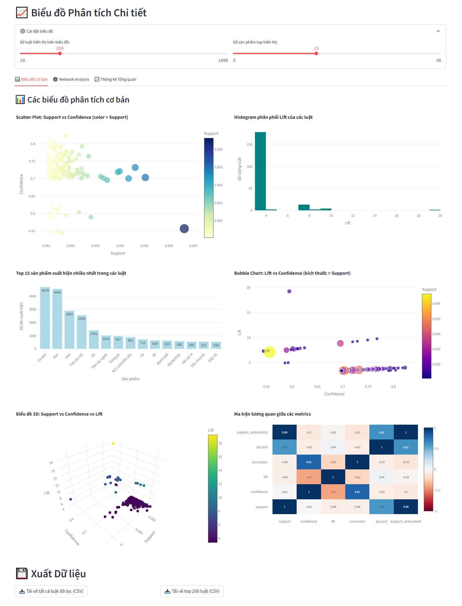
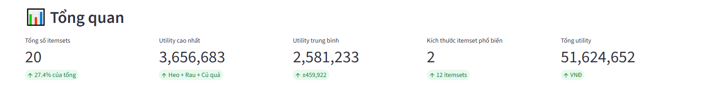
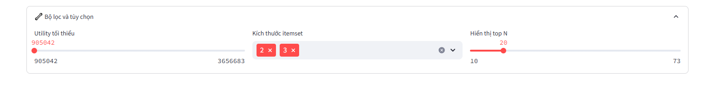
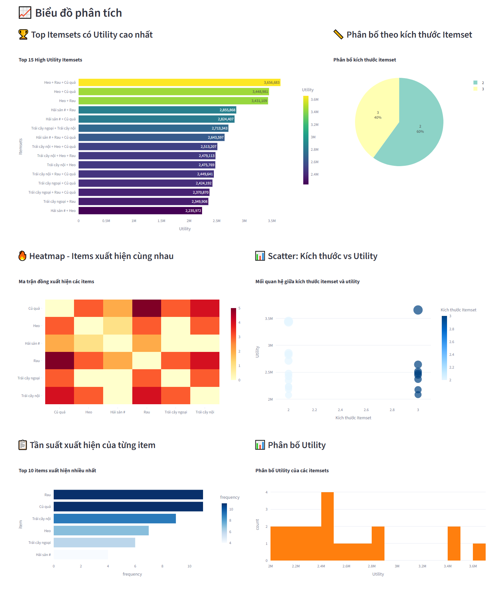
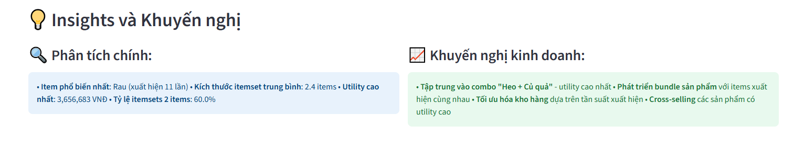

# FP-Growth
The dashboard consists of 4 main components:

| **Component**         | **Description**                                                                                                                                               |
|-----------------------|---------------------------------------------------------------------------------------------------------------------------------------------------------------|
| **Control Panel**     | Enables users to adjust input parameters for executing the FP-Growth method, such as support threshold, confidence level, lift,...                         |
| **Main Network Graph**| Visualizes the relationships between product groups through a network diagram, highlighting strong associations among product groups that frequently appear together. |
| **Node Details**      | Displays a list of association rules related to the selected product group, including antecedent (the IF condition of a rule),  consequent (the THEN outcome of a rule), support, confidence and lift metrics.         |
| **Detailed Analytics**| Provides additional charts for analyzing the relationships between product groups, helping users better understand the characteristics and strength of associations. |

## 1.Control Panel

### Overview Information

| **Metric**         | **Description**                                                                                                                                                                                                                             | **Example / Note**                                                                                      |
|--------------------|---------------------------------------------------------------------------------------------------------------------------------------------------------------------------------------------------------------------------------------------|----------------------------------------------------------------------------------------------------------|
| **Support Threshold** | The proportion of transactions in which a group of products appears within the entire dataset.                                                                                                                                            | *Support = 0.05* → Product group appears in at least 5% of all transactions.                            |
| **Confidence Level**  | The probability that when one group of products is purchased, another group is also purchased. Used to assess the reliability of an association rule.                                                                                     | *Confidence = 0.8* → In 80% of transactions containing product A, product B also appears.               |
| **Lift**              | Measures the strength of an association rule by comparing the observed co-occurrence of two product groups to the expected co-occurrence if they were independent.                                                                       | *Lift = 1*: Independent *Lift > 1*: Positive relationship *Lift < 1*: Negative relationship       |
| **Total Rules**       | The number of association rules generated after applying the FP-Growth algorithm, based on selected support and confidence thresholds. Provides an overview of the extent of associations between product groups.                        | Indicates how many meaningful rules were found given the user-defined thresholds.                      |

### The main filters:
The main filters allow users to adjust parameters to extract the most relevant association rules:

| **Filter**               | **Description**                                                                                                                                                                                      |
|--------------------------|------------------------------------------------------------------------------------------------------------------------------------------------------------------------------------------------------|
| **Min Support**          | The minimum proportion of product groups or combinations of product groups that appear in the entire dataset.                                                                                       |
| **Min Confidence**       | The minimum probability that product B is purchased given that product A has already been purchased.                                                                                                |
| **Min Lift**             | Sets a threshold to filter out weak or random relationships, keeping only stronger, more meaningful associations.                                                                                   |
| **Min Support Antecedent** | The minimum proportion of transactions containing the antecedent, ensuring only sufficiently common conditions are analyzed.                                                                        |
| **Min Conviction**       | Measures the reliability of a rule compared to the probability of it being incorrect, filtering out rules with high violation risk.                                                                 |
| **Min Interest**         | Captures the deviation between actual co-occurrence and the expected probability if the products were independent, identifying rules that reflect true interaction.                                |
| **Min Jaccard**          | The Jaccard index is calculated as the number of transactions containing both the antecedent and consequent divided by the number of transactions containing at least one of the two. Ensures rules have significant overlap. |

 

## 2.Main network graph
Allows users to set up metrics for the network graph:

| **Setting**                      | **Description**                                                                                                                                                                              |
|----------------------------------|----------------------------------------------------------------------------------------------------------------------------------------------------------------------------------------------|
| **Top N strong rules**           | Select the number of strongest association rules to be displayed in the graph.                                                                                                               |
| **Show labels for nodes with degree ≥** | Only display labels for nodes with a degree (number of connections) above a specified threshold, helping to focus on key nodes.                                                              |
| **Highlight nodes by**          | Allows highlighting of nodes based on a specific metric, such as number of incoming (in_degree) or outgoing (out_degree) connections.                                                        |
| **Highlight top % nodes**       | Highlights the top percentage of nodes with the highest values based on the selected metric (e.g., in_degree, out_degree), making it easier to identify the most important nodes in the graph. |
| **Show labels for nodes by**    | Defines the criteria for displaying node labels, such as by in_degree, out_degree or both.                                                                                                   |
| **Layout Network Graph**        | Choose the layout style for the network graph, such as circular or spring layout, to improve visualization and readability.                                                                  |

 

## 3.Node Details
Allows users to view detailed information about the **association rules** related to a specific product group:

| **Feature**                               | **Description**                                                                                                                                                                      |
|-------------------------------------------|--------------------------------------------------------------------------------------------------------------------------------------------------------------------------------------|
| **Select a node to view related rules**   | Choose any node from the list to see the association rules connected to the corresponding product group.                                                                           |
| **Rules originating from this node**      | Displays rules where the selected product group appears as the **antecedent**, i.e., as a condition leading to the purchase of other groups.                                       |
| **Rules leading to this node**            | Displays rules where the selected product group appears as the **consequent**, i.e., as a result inferred from other purchased groups.                                              |
| **Association rules details**             | Each rule includes 5 key columns:                                                                                                                                                    |
| _→ Consequent_                          | Product group(s) likely to be purchased **in addition to** the antecedent.                                                                                                           |
| _→ Antecedent_                          | Product group(s) already purchased, forming the **condition**.                                                                                                                       |
| _→ Support_                             | Frequency of transactions containing **both** antecedent and consequent; reflects rule popularity in the dataset.                                                                  |
| _→ Confidence_                          | Probability of buying the consequent **given** the antecedent has been purchased; higher values indicate stronger rules.                                                           |
| _→ Lift_                                | Measures how much more likely the consequent is purchased **when** the antecedent is present, compared to if they were independent. Lift > 1 indicates a positive association.      |

 

## 4.Detailed Analytics
This feature allows users to visualize association rules through interactive charts and customize the scope of analysis using the following parameters:

-	**Number of rules displayed in the chart:** Limits the number of association rules shown, helping users focus on the most relevant relationships based on criteria such as Confidence, Lift or Support.
-	**Number of top products displayed:** Filters and displays the most frequently occurring product groups in the association rules, helping users identify items that strongly influence purchasing behavior or are frequently bought together.

Additionally, users can select from the following visualization modes:

| **Category**         | **Chart Type / Feature**                  | **Description**                                                                                                                                         |
|----------------------|-------------------------------------------|---------------------------------------------------------------------------------------------------------------------------------------------------------|
| **Basic Charts**     | **Scatter Plot – Support vs. Confidence** | Displays the correlation between Support and Confidence, with dot color representing Support values.                                                   |
|                      | **Histogram – Lift Distribution**         | Shows the distribution of Lift values across all association rules.                                                                                     |
|                      | **Column Chart – Top 15 Products**        | Displays the top 15 most frequently appearing products in the rules.                                                                                    |
|                      | **Bubble Chart – Lift vs. Confidence**    | Visualizes the relationship between Lift and Confidence, with bubble size representing Support.                                                         |
|                      | **3D Chart – Support, Confidence, Lift**  |Visualizes the relationship among all three metrics in association rule analysis. (_High Lift – Low Support: rare but potentially valuable rules, worth attention (e.g., for marketing or cross-selling). High Confidence – Low Lift: May not be meaningful, possibly reflecting only the popularity of an item.)_|                                                                         |
|                      | **Heatmap**                               | A matrix showing the degree of correlation between different metrics.                                                                                   |
| **Network Graph**    | Network view                              | Represents the relationships among product groups in a network structure, including both full and simplified views.                                    |
| **Summary Statistics** | Key metrics + Top 10 rules               | Displays key metrics and a ranked list of the Top 10 strongest rules.                                                                                   |

_**Definitions:**_

-	_**Support:** The frequency of a rule within the entire dataset._
-	_**Confidence:** The probability that the Consequent (THEN part of a rule) appears in a transaction that already contains all items in the Antecedent (IF part of a rule)._
-	_**Lift:** The strength of association between products within a rule._

 

---

# HUIM

The dashboard consists of 5 main components:

| **Component**             | **Description**                                                                                                                                         |
|---------------------------|---------------------------------------------------------------------------------------------------------------------------------------------------------|
| **Control Panel**         | Allows users to customize HUIM analysis parameters such as minimum utility value, itemset size, and the number of top itemsets displayed.              |
| **Overview Section**      | Provides a summary of key metrics including the total number of itemsets, highest utility, average utility, most common itemset size, and total utility. |
| **Analytical Charts**     | Offers a set of intuitive visualizations to analyze the relationships between product groups and their generated value.                                |
| **Detail Table**          | Displays detailed data on the highest-utility itemsets, including itemset names, utility values, sizes, and clearly formatted figures.                 |
| **Insights & Recommendation** | Summarizes key analyses (e.g., most frequent itemsets, averages, ratios) and provides business recommendations.                                   |

## 1.Filters and Options

This section allows users to customize the scope of the HUIM analysis through the following parameters:

| **Parameter**         | **Description**                                                                                 |
|-----------------------|-----------------------------------------------------------------------------------------------|
| **Minimum Utility**   | Defines the minimum utility value for an itemset to be considered significant.                |
| **Itemset Size**      | Specifies the number of product groups in each itemset.                                       |
| **Display Top N**     | Limits the number of itemsets displayed, ranked by their utility score.                       |

 

## 2.Overview of Key Metrics

Provides a summary of prominent characteristics from high-utility itemsets, helping users assess the quality and distribution of the analysis results:

| **Metric**                  | **Description**                                                                                                         |
|----------------------------|-------------------------------------------------------------------------------------------------------------------------|
| **Total Number of Itemsets** | The number of itemsets that meet the minimum utility threshold based on current filter conditions.                     |
| **Highest Utility**          | The maximum utility value among all itemsets, indicating which product group combination generates the highest value. |
| **Average Utility**          | The average utility value across all itemsets, reflecting the general level of value provided by product combinations.|
| **Most Common Itemset Size** | The most frequently occurring number of product groups in itemsets, showing whether customer purchases tend to group into small or large sets. |
| **Total Utility**            | The sum of utility values from all itemsets, representing the total contribution of product group combinations to the business. |

 

## 3.Analytical Charts

| **Chart Type**     | **Description**                                                                 |
|--------------------|---------------------------------------------------------------------------------|
| **Bar Chart**       | Displays the Top 15 itemsets with the highest utility.                         |
| **Pie Chart**       | Shows the distribution ratio by itemset size.                                  |
| **Heatmap**         | A matrix representing the co-occurrence of items.                              |
| **Scatterplot**     | Visualizes the correlation between itemset size and utility.                   |
| **Bar Chart**       | Displays the frequency of individual item appearances.                         |
| **Histogram**       | Shows the distribution of itemsets by utility value ranges.                    |

 

## 4.Detailed Table

A table presenting the Top 20 itemsets with the highest utility, including the following columns:

| **Field**   | **Description**                                                            |
|-------------|-----------------------------------------------------------------------------|
| **Itemset** | A combination of product groups based on association rules.                |
| **Utility** | The average revenue generated from each association rule.                  |
| **Size**    | The number of product groups in the combination.                           |

 

## 5.Insights and Recommendations

Summarizes key findings from data analysis and translates them into actionable business suggestions. The goal is to support more effective layout planning by highlighting popular or high-value product group combinations, while also recommending product bundling and cross-selling strategies. This contributes to improving business performance and enhancing customer experience. 

