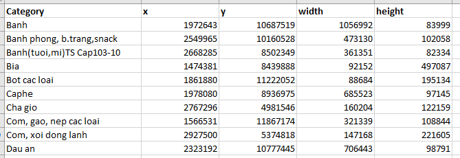
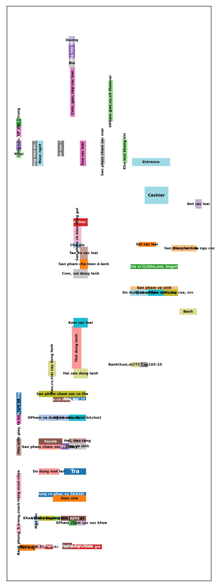

# 6. Output
## 6.1 Raw data processing

### FP-Growth
The dashboard consists of 4 main components:

| **Component**         | **Description**                                                                                                                                               |
|-----------------------|---------------------------------------------------------------------------------------------------------------------------------------------------------------|
| **Control Panel**     | Enables users to adjust input parameters for executing the FP-Growth method, such as support threshold, confidence level, lift,...                         |
| **Main Network Graph**| Visualizes the relationships between product groups through a network diagram, highlighting strong associations among product groups that frequently appear together. |
| **Node Details**      | Displays a list of association rules related to the selected product group, including antecedent (the IF condition of a rule),  consequent (the THEN outcome of a rule), support, confidence and lift metrics.         |
| **Detailed Analytics**| Provides additional charts for analyzing the relationships between product groups, helping users better understand the characteristics and strength of associations. |

 

---

### HUIM

The dashboard consists of 5 main components:

| **Component**             | **Description**                                                                                                                                         |
|---------------------------|---------------------------------------------------------------------------------------------------------------------------------------------------------|
| **Control Panel**         | Allows users to customize HUIM analysis parameters such as minimum utility value, itemset size, and the number of top itemsets displayed.              |
| **Overview Section**      | Provides a summary of key metrics including the total number of itemsets, highest utility, average utility, most common itemset size, and total utility. |
| **Analytical Charts**     | Offers a set of intuitive visualizations to analyze the relationships between product groups and their generated value.                                |
| **Detail Table**          | Displays detailed data on the highest-utility itemsets, including itemset names, utility values, sizes, and clearly formatted figures.                 |
| **Insights & Recommendation** | Summarizes key analyses (e.g., most frequent itemsets, averages, ratios) and provides business recommendations.                                   |

## 6.2 External data processing

**Input:** *The input is a PowerPoint file containing the store layout. In this file, each product group’s area is marked using shapes (such as rectangles or polygons) to indicate its position on the floor plan. A preprocessing script is run to extract these shapes’ category labels, coordinates, and dimensions, converting them into a CSV file with columns: Category, x, y, width, height. This CSV serves as the initial configuration for the optimization process.*

  <strong style="color: #4051b5; font-size: 24px;">LAYOUT INPUT</strong> 

  PPTX input file  

  CSV input file 

## 6.3 Simulated Annealing Algorithm

**Output**: *The output is an Excel/CSV file generated after running the SA algorithm, containing the columns: slide_idx, shape_idx, shape_obj, Category, x, y, width, height, cx, cy, is_entrance, is_cashier, is_refrigerated. This file is then processed by the program to draw and export the store layout image.*

CSV output file 

  <strong style="color: #4051b5; font-size: 24px;">LAYOUT INPUT</strong> 

## 6.4 Genetic Algorithm with Greedy and Local Search
need to update....